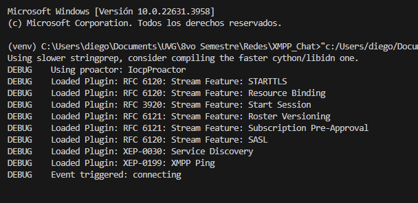

# Proyecto - Cliente XMPP

**Universidad del Valle de Guatemala**
**Facultad de Ingeniería**
**Departamento de Ciencias de la Computación**
**Redes**

---

## Autor
**Diego Leiva**

## Repo
https://github.com/LeivaDiego/XMPP_Chat.git
---

### Avances 
**Version 0.1** 
- Primer intento de cliente simple para conectarse al servidor

    Descripcion: El cliente parece ejecutar los comandos pero no recibe respuesta de servidor. (Se queda estancado esperando el evento de conexión)